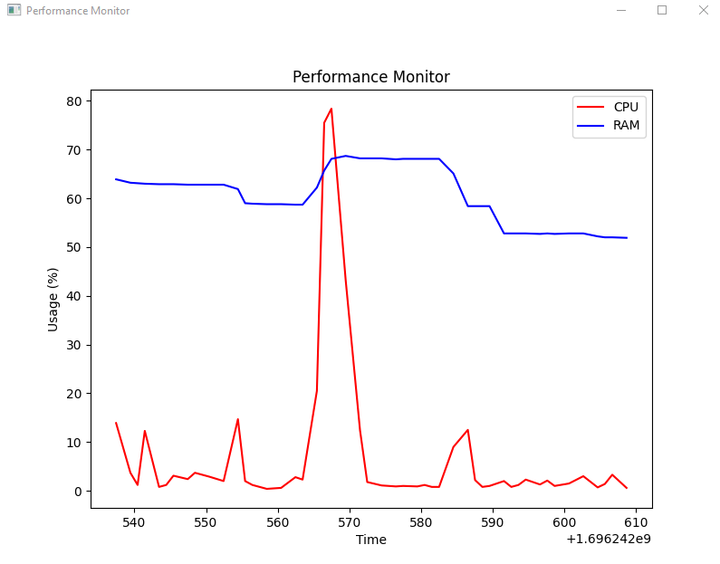

# PerformanceMonitor
Mini program to see cpu/ram performance graphically in real time 

## Installation

Use the package manager [pip](https://pip.pypa.io/en/stable/) to install packages in requirements.txt.

```bash
pip install -r requirements.txt
```
## Usage

```python
python StatPc.py
```

## Graphic's screenshot 


